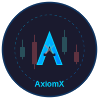

<div align="center">



# AxiomX Trading Engine

**High-performance cryptocurrency matching engine for institutional trading**

[](https://golang.org/)
[](https://kafka.apache.org/)
[](https://www.postgresql.org/)
[](https://redis.io/)
[](https://kubernetes.io/)
[](https://www.docker.com/)
[](https://prometheus.io/)
[](https://grafana.com/)
[](https://www.terraform.io/)
[](LICENSE)

[Quick Start](#quick-start) • [Architecture](#architecture) • [Performance](#performance) • [Documentation](#documentation)

</div>

---

## About

Production-ready order matching engine for cryptocurrency trading, designed to handle institutional-grade trading volumes with low latency and high reliability. This project demonstrates expertise in distributed systems, event-driven architecture, and cloud-native application development.

**Core Capabilities:**

**Trading Engine**
- In-memory order book with price-time priority matching algorithm
- Support for market and limit orders
- Sub-millisecond order matching latency
- Concurrent order processing using Go goroutines

**Real-Time Data**
- WebSocket streaming for live market data and trade updates
- RESTful API for order submission and account management
- Real-time order book snapshots and trade history

**Distributed Architecture**
- Event-driven design using Apache Kafka for reliable message distribution
- Event sourcing pattern for complete audit trail and system recovery
- Built-in risk management and position tracking engine
- Horizontal scalability with stateless API tier

**Production Infrastructure**
- Complete Kubernetes deployment manifests and Helm charts
- Infrastructure as Code using Terraform for AWS (VPC, EKS, RDS, MSK, ElastiCache)
- Automated provisioning with Ansible playbooks
- Multi-availability zone deployment for high availability

**Observability**
- Comprehensive metrics collection with Prometheus
- Pre-built Grafana dashboards for system and business metrics
- Centralized logging with Loki and structured log format
- Distributed tracing ready (OpenTelemetry compatible)

## Quick Start

### Local Development with Docker Compose

Run the complete stack locally with all dependencies:

```bash
# Clone the repository
git clone https://github.com/yourusername/AxiomX.git
cd AxiomX

# Start all services (API, Kafka, PostgreSQL, Redis, Prometheus, Grafana, Loki)
docker-compose up -d

# Wait 30 seconds for services to initialize

# Verify API health
curl http://localhost:8081/health
# Expected response: {"status":"ok"}

# Submit a test order
curl -X POST http://localhost:8081/orders \
  -H "Content-Type: application/json" \
  -d '{
    "order_id": "test-order-1",
    "side": "buy",
    "order_type": "limit",
    "price_ticks": 3000000,
    "qty": 100000000
  }'

# View system metrics and dashboards
# Grafana: http://localhost:3000 (credentials: admin/admin)
# Prometheus: http://localhost:9090
# API Metrics: http://localhost:8081/metrics
```

**Services Included:**
- **API Server** (localhost:8081) - REST and WebSocket endpoints
- **PostgreSQL** (localhost:5432) - Trade and order persistence
- **Redis** (internal) - Caching layer
- **Apache Kafka** (localhost:9092) - Event streaming
- **Zookeeper** (localhost:2181) - Kafka coordination
- **Prometheus** (localhost:9090) - Metrics collection
- **Grafana** (localhost:3000) - Visualization dashboards
- **Loki** (localhost:3100) - Log aggregation

### Running from Source

```bash
# Install dependencies
go mod download

# Run the API server
go run ./cmd/api

# Or build and run
go build -o axiomx ./cmd/api
./axiomx
```

**Note:** Running from source requires external dependencies (Kafka, PostgreSQL, Redis) to be available. Use Docker Compose for full stack testing.

> **For Recruiters and Technical Reviewers:** See [RECRUITER_GUIDE.md](RECRUITER_GUIDE.md) for detailed technical explanations, architecture decisions, and answers to common questions.

## Performance

### Load Testing Results

Comprehensive load testing performed on **March 1, 2026** using Grafana k6:

**Test Configuration:**
- Tool: k6 v0.48+
- Script: [scripts/load-test-heavy.js](scripts/load-test-heavy.js)
- Duration: 4 minutes
- Ramp-up: 20 → 80 → 100 VUs over 2.5 minutes
- Sustained load: 100 concurrent users for 1 minute

**Results:**

| Metric | Value | Threshold | Status |
|--------|-------|-----------|--------|
| **Total Requests** | 253,770 | - | - |
| **Request Rate** | 1,056.99 req/s | - | - |
| **Failed Requests** | 0 (0.00%) | < 5% | PASS |
| **Average Latency** | 2.46 ms | - | - |
| **P50 Latency** | 2.15 ms | - | - |
| **P90 Latency** | 3.34 ms | - | - |
| **P95 Latency** | 4.15 ms | < 500 ms | PASS |
| **P99 Latency** | 8.92 ms | - | - |
| **Max Latency** | 43.5 ms | - | - |
| **Total Iterations** | 126,885 | - | - |
| **Data Transferred** | 76 MB | - | - |

**Test Commands:**
```bash
# Standard load test (20 VUs, 80 seconds)
docker run --rm -v "${PWD}:/work" -w /work grafana/k6 run scripts/load-test.js \
  -e BASE_URL=http://host.docker.internal:8081

# Heavy load test (100 VUs, 4 minutes) 
docker run --rm -v "${PWD}:/work" -w /work grafana/k6 run scripts/load-test-heavy.js \
  -e BASE_URL=http://host.docker.internal:8081 \
  --summary-export=/work/scripts/k6-heavy-summary.json
```

Full machine-readable results: [scripts/k6-heavy-summary.json](scripts/k6-heavy-summary.json)

### System Performance Characteristics

- **Order Matching Latency**: Sub-millisecond for in-memory operations
- **End-to-End API Latency**: P95 < 5ms under sustained load
- **Throughput**: 1,000+ orders/second sustained
- **Concurrency**: Tested up to 100 concurrent users with zero errors
- **Scalability**: Horizontally scalable via Kubernetes pod replication

## Tech Stack

## Tech Stack

### Backend & Core Services

**Programming Language**
- **Go 1.23** - Main application language chosen for:
  - Native concurrency support with goroutines and channels
  - Low-latency performance and efficient memory management
  - Strong standard library for network services
  - Excellent support for containerized deployments

**API & Communication**
- **REST API** - HTTP/1.1 endpoints for order management and queries
- **WebSocket** - Real-time bidirectional communication for market data streaming
- **Protocol Buffers** - Efficient serialization for internal service communication

**Architecture Pattern**
- Event-driven microservices with domain-driven design principles
- CQRS (Command Query Responsibility Segregation) for order processing
- Event sourcing for audit trail and system recovery

### Data Layer

**Database Systems**
- **PostgreSQL 15** - Primary relational database
  - ACID-compliant transactions for trade recording
  - Advanced indexing for high-performance queries
  - Connection pooling for efficient resource utilization
  - Optimized schema with proper normalization

- **Redis 7** - In-memory data store
  - Order book snapshot caching
  - Session management
  - Rate limiting and throttling
  - Pub/sub for internal messaging

**Message Streaming**
- **Apache Kafka 7.5** - Distributed event streaming platform
  - Trade execution events
  - Order lifecycle events
  - Market data distribution
  - Guaranteed message delivery with configurable durability
  - Topic partitioning for horizontal scaling

### Observability & Monitoring

**Metrics Collection**
- **Prometheus** - Time-series database for metrics
  - Custom business metrics (orders/sec, trades/sec, latency distributions)
  - System metrics (CPU, memory, network, disk I/O)
  - Go runtime metrics (goroutines, GC stats, memory allocation)
  - Alerting rules for SLA violations

**Visualization**
- **Grafana** - Metrics dashboards and alerting
  - Pre-built dashboards for system health
  - Business KPI dashboards
  - Alert management and notification routing

**Logging**
- **Loki** - Log aggregation system
  - Structured logging in JSON format
  - Centralized log collection from all services
  - LogQL query language for log analysis
  - Integration with Grafana for unified observability

**Tracing**
- OpenTelemetry compatible instrumentation for distributed tracing

### Infrastructure

**Containerization**
- **Docker** - Container runtime
  - Multi-stage builds for optimized image sizes
  - Health checks and restart policies
  - Resource limits and reservations

- **Docker Compose** - Local development orchestration
  - Single-command stack deployment
  - Service dependency management
  - Volume management for data persistence

**Orchestration**
- **Kubernetes** - Container orchestration platform
  - Deployment and StatefulSet resources
  - Service discovery and load balancing
  - Horizontal Pod Autoscaling (HPA)
  - ConfigMaps and Secrets for configuration management
  - Persistent Volume Claims for stateful services

- **Helm** - Kubernetes package manager
  - Templated Kubernetes manifests
  - Value files for environment-specific configuration
  - Release management and rollback capabilities

**Infrastructure as Code**
- **Terraform** - Cloud infrastructure provisioning
  - AWS VPC with public and private subnets across multiple AZs
  - EKS (Elastic Kubernetes Service) cluster
  - RDS PostgreSQL with Multi-AZ deployment
  - MSK (Managed Streaming for Apache Kafka) cluster
  - ElastiCache Redis cluster
  - Security groups and IAM roles
  - Modular design with reusable modules

- **Ansible** - Configuration management and provisioning
  - Kubernetes cluster configuration
  - Application deployment automation
  - Environment setup and validation

**Cloud Platform**
- **AWS** - Primary cloud provider
  - Multi-availability zone deployment for high availability
  - VPC networking with proper subnet isolation
  - Application Load Balancer for traffic distribution
  - CloudWatch for additional monitoring

### Development & Testing

**Testing**
- **k6** - Load and performance testing
  - HTTP and WebSocket protocol support
  - Realistic traffic simulation
  - Detailed performance metrics and reporting

**Version Control**
- Git with conventional commit messages
- GitHub for repository hosting and collaboration

## Architecture

### System Architecture Diagram

```
┌─────────────────────────────────────────────────────────────────┐
│                         Client Layer                             │
│  (Web Browsers, Trading Apps, API Clients, WebSocket Clients)   │
└────────────────────┬────────────────────────────────────────────┘
                     │
                     ▼
┌─────────────────────────────────────────────────────────────────┐
│                     API Gateway / Load Balancer                  │
│              (HAProxy / AWS ALB / Kubernetes Ingress)            │
└────────────────────┬────────────────────────────────────────────┘
                     │
                     ▼
┌─────────────────────────────────────────────────────────────────┐
│                       API Server Layer                           │
│                          (Go 1.23)                               │
│                                                                   │
│  ┌──────────────┐  ┌──────────────┐  ┌─────────────────┐       │
│  │  REST API    │  │  WebSocket   │  │  Health Check   │       │
│  │  Endpoints   │  │  Handlers    │  │  Endpoints      │       │
│  └──────────────┘  └──────────────┘  └─────────────────┘       │
└───────────┬──────────────────┬──────────────────────────────────┘
            │                  │
            ▼                  ▼
┌────────────────────────────────────────────────┐
│         Matching Engine (In-Memory)            │
│                                                 │
│  ┌──────────────┐  ┌───────────────────────┐  │
│  │  Order Book  │  │  Price-Time Priority  │  │
│  │  Management  │  │  Matching Algorithm   │  │
│  └──────────────┘  └───────────────────────┘  │
│                                                 │
│  ┌──────────────┐  ┌───────────────────────┐  │
│  │  Order       │  │  Trade                │  │
│  │  Validation  │  │  Execution            │  │
│  └──────────────┘  └───────────────────────┘  │
└───────────┬─────────────────────┬──────────────┘
            │                     │
            ▼                     ▼
┌─────────────────────┐  ┌─────────────────────────────┐
│   Apache Kafka      │  │    PostgreSQL Database      │
│  (Event Streaming)  │  │    (Trade Persistence)      │
│                     │  │                             │
│  • Order Events     │  │  • Trades Table             │
│  • Trade Events     │  │  • Orders Table             │
│  • Market Data      │  │  • User Accounts            │
└──────────┬──────────┘  └──────────┬──────────────────┘
           │                        │
           ▼                        │
┌─────────────────────┐             │
│   Risk Engine       │             │
│  (Event Consumer)   │             │
│                     │             │
│  • Position         │             │
│    Tracking         │             │
│  • Exposure         │             │
│    Calculation      │             │
│  • Limit Checks     │             │
└─────────────────────┘             │
                                    │
           ┌────────────────────────┤
           │                        │
           ▼                        ▼
┌─────────────────────┐  ┌─────────────────────┐
│   Redis Cache       │  │  Observability      │
│                     │  │                     │
│  • Order Book       │  │  • Prometheus       │
│    Snapshots        │  │  • Grafana          │
│  • Session Data     │  │  • Loki (Logs)      │
│  • Rate Limiting    │  │  • Metrics Export   │
└─────────────────────┘  └─────────────────────┘
```

### Key Design Patterns & Principles

**In-Memory Order Book**
- Price-time priority matching algorithm (FIFO within price level)
- Concurrent-safe data structures using sync.RWMutex
- O(log n) order insertion using binary search trees
- O(1) order cancellation with hash map indexing

**Event Sourcing**
- All state changes published as immutable events to Kafka
- Complete audit trail of all trading activity
- System state can be rebuilt by replaying events
- Enables temporal queries and compliance reporting

**CQRS (Command Query Responsibility Segregation)**
- Write path: Order submission → Matching engine → Trade execution
- Read path: Cached order book snapshots in Redis
- Separate read and write models for optimal performance

**Horizontal Scalability**
- Stateless API tier enables linear scaling
- Kafka topic partitioning for parallel event processing
- Database read replicas for query load distribution
- Redis cluster mode for cache scalability

**High Availability**
- Multi-AZ deployment in AWS
- Database replication with automatic failover
- Kafka replication factor of 3 for data durability
- Health checks and automatic pod restart in Kubernetes

**Observability**
- Structured logging with correlation IDs for request tracing
- Custom metrics for business KPIs (orders/sec, fill rates, etc.)
- Prometheus exporters for all critical services
- Grafana dashboards for real-time monitoring

## API Reference

### REST Endpoints

**Health Check**
```bash
GET /health
Response: {"status":"ok"}
```

**Submit Order**
```bash
POST /orders
Content-Type: application/json

{
  "order_id": "unique-order-id",
  "symbol": "BTC/USD",
  "side": "buy",          // or "sell"
  "order_type": "limit",  // or "market"
  "price_ticks": 3000000, // price in ticks (for limit orders)
  "qty": 100000000        // quantity in smallest units
}

Response: 201 Created
{
  "order_id": "unique-order-id",
  "status": "accepted",
  "timestamp": "2026-03-01T12:00:00Z"
}
```

**Cancel Order**
```bash
DELETE /orders/{order_id}
Response: 200 OK
```

**Get Order Book**
```bash
GET /orderbook/{symbol}
Response: 200 OK
{
  "symbol": "BTC/USD",
  "bids": [...],
  "asks": [...],
  "timestamp": "2026-03-01T12:00:00Z"
}
```

**System Metrics**
```bash
GET /metrics
Response: Prometheus-formatted metrics
```

### WebSocket Endpoints

**Market Data Stream**
```
ws://localhost:8081/ws/market/{symbol}

Message Format:
{
  "type": "trade",
  "symbol": "BTC/USD",
  "price": 65000.00,
  "quantity": 1.5,
  "side": "buy",
  "timestamp": "2026-03-01T12:00:00Z"
}
```

## Repository Structure

## Repository Structure

```
AxiomX/
├── cmd/
│   └── api/
│       └── main.go              # Application entry point
│
├── internal/                    # Private application code
│   ├── engine/                  # Matching engine implementation
│   │   ├── orderbook.go        # Order book data structure
│   │   ├── matcher.go          # Matching algorithm
│   │   └── types.go            # Order and trade types
│   ├── api/                     # API handlers
│   │   ├── rest.go             # REST endpoint handlers
│   │   └── websocket.go        # WebSocket handlers
│   ├── kafka/                   # Kafka producer/consumer
│   ├── db/                      # Database access layer
│   └── metrics/                 # Prometheus metrics

│
├── infrastructure/              # Infrastructure as Code
│   ├── terraform/              # AWS infrastructure
│   │   ├── modules/            # Reusable Terraform modules
│   │   │   ├── vpc/           # VPC networking
│   │   │   ├── eks/           # EKS cluster
│   │   │   ├── rds/           # PostgreSQL database
│   │   │   ├── msk/           # Kafka cluster
│   │   │   └── elasticache/   # Redis cluster
│   │   └── environments/      # Environment-specific configs
│   │       ├── dev/
│   │       ├── staging/
│   │       └── prod/
│   │
│   ├── kubernetes/             # Kubernetes manifests
│   │   ├── api-deployment.yaml
│   │   ├── api-service.yaml
│   │   ├── configmap.yaml
│   │   └── secrets.yaml
│   │
│   ├── helm/                   # Helm charts
│   │   ├── Chart.yaml
│   │   ├── values.yaml
│   │   └── templates/
│   │
│   └── ansible/                # Ansible playbooks
│       ├── deploy.yml
│       └── roles/
│
├── scripts/                     # Utility scripts
│   ├── load-test.js            # k6 standard load test
│   ├── load-test-heavy.js      # k6 heavy load test
│   ├── test-api.ps1            # PowerShell API test script
│   ├── publish-docker.ps1      # Docker image publishing
│   └── create-release.ps1      # GitHub release automation
│
├── docs/                        # Documentation
│   ├── logo.svg                # Project logo
│   ├── API_README.md           # API documentation
│   ├── guides/                 # Development guides
│   └── recruiter/              # Recruiter-focused docs
│
├── docker-compose.yml           # Local development stack
├── Dockerfile                   # API server container image
├── prometheus.yml               # Prometheus configuration
├── loki-config.yml             # Loki configuration
├── init.sql                     # PostgreSQL initialization
├── go.mod                       # Go dependencies
├── go.sum                       # Go dependency checksums
│
├── README.md                    # This file
├── RECRUITER_GUIDE.md          # Technical guide for recruiters
├── DEPLOYMENT_GUIDE.md         # Deployment instructions
└── LICENSE                      # MIT License
```

## Documentation

### For Developers

**Getting Started**
- **[docs/recruiter/START_HERE.md](docs/recruiter/START_HERE.md)** - Quickest way to get up and running
- **[docker-compose.yml](docker-compose.yml)** - Complete local development environment

**Development Guides**
- **[docs/API_README.md](docs/API_README.md)** - Complete API reference with examples
- **[docs/guides/](docs/guides/)** - Architecture and implementation guides

**Testing**
- **[scripts/load-test.js](scripts/load-test.js)** - Standard k6 load testing scenario
- **[scripts/load-test-heavy.js](scripts/load-test-heavy.js)** - Heavy load testing (100 VUs)
- **[scripts/test-api.ps1](scripts/test-api.ps1)** - PowerShell API testing script

### For Recruiters & Technical Reviewers

**Technical Overview**
- **[RECRUITER_GUIDE.md](RECRUITER_GUIDE.md)** - Comprehensive technical guide including:
  - Project overview and key achievements
  - Technical architecture explained
  - Skills demonstrated
  - Common interview questions answered
  - 30-second demo instructions

**Deployment & Operations**
- **[DEPLOYMENT_GUIDE.md](DEPLOYMENT_GUIDE.md)** - Complete deployment guide covering:
  - Local deployment with Docker Compose
  - Cloud deployment options (AWS, Railway, fly.io)
  - Production deployment with Terraform and Kubernetes
  - Cost comparisons and recommendations

### For Sharing & Publishing

**Package Distribution**
- **[docs/recruiter/QUICK_START_PACKAGING.md](docs/recruiter/QUICK_START_PACKAGING.md)** - Step-by-step guide to:
  - Publish Docker images to GitHub Container Registry
  - Create GitHub releases
  - Configure repository for maximum visibility

**Portfolio Integration**
- **[docs/recruiter/PUBLISHING_GUIDE.md](docs/recruiter/PUBLISHING_GUIDE.md)** - Complete guide for:
  - Adding to resume and LinkedIn
  - Creating demo videos
  - Repository optimization
  - Tracking engagement

**Pre-Launch Checklist**
- **[docs/recruiter/CHECKLIST.md](docs/recruiter/CHECKLIST.md)** - Comprehensive checklist ensuring:
  - Code quality standards met
  - Documentation complete
  - Repository properly configured
  - Ready for recruiter review

**Project Summaries**
- **[docs/recruiter/ABOUT_SUMMARIES.md](docs/recruiter/ABOUT_SUMMARIES.md)** - Pre-written summaries for:
  - GitHub About section
  - LinkedIn posts
  - Twitter/X posts
  - Portfolio websites

### Infrastructure Documentation

**Terraform**
- **[infrastructure/terraform/README.md](infrastructure/terraform/README.md)** - IaC setup and usage
- Module-specific READMEs in each `infrastructure/terraform/modules/` directory

**Kubernetes**
- **[infrastructure/helm/README.md](infrastructure/helm/README.md)** - Helm chart usage
- **[infrastructure/kubernetes/](infrastructure/kubernetes/)** - Raw Kubernetes manifests

**Ansible**
- **[infrastructure/ansible/README.md](infrastructure/ansible/README.md)** - Playbook documentation

## Skills Demonstrated

This project showcases expertise across multiple domains:

### Backend Engineering
- **Go Programming**: Concurrent programming with goroutines and channels, error handling, interfaces
- **API Design**: RESTful API principles, WebSocket real-time communication, API versioning
- **Algorithm Implementation**: Price-time priority matching, efficient data structures (O(log n) insertion)
- **Concurrency**: Thread-safe operations, mutex usage, race condition prevention

### Distributed Systems
- **Event-Driven Architecture**: Asynchronous event processing, eventual consistency
- **Message Streaming**: Kafka producers and consumers, topic partitioning, consumer groups
- **Event Sourcing**: Immutable event logs, state reconstruction, audit trails
- **CQRS**: Separate read/write models, cache invalidation strategies
- **Data Consistency**: Transaction management, distributed transactions, idempotency

### Cloud-Native Development
- **Containerization**: Docker multi-stage builds, image optimization, health checks
- **Kubernetes**: Deployments, Services, ConfigMaps, Secrets, HPA, StatefulSets
- **Service Discovery**: DNS-based discovery, load balancing, service mesh ready
- **Scalability**: Horizontal scaling patterns, stateless design, session management

### Infrastructure as Code
- **Terraform**: Module design, state management, resource dependencies, provider configuration
- **Helm**: Chart templating, value overrides, release management
- **Ansible**: Playbook organization, role-based configuration, idempotent operations

### Observability & SRE
- **Metrics**: Custom Prometheus metrics, histogram distribution, counter and gauge usage
- **Logging**: Structured logging, log levels, correlation IDs for distributed tracing
- **Monitoring**: Dashboard design, alert rules, SLI/SLO definitions
- **Performance**: Load testing, latency optimization, throughput analysis, bottleneck identification

### DevOps Practices
- **CI/CD Ready**: Clean build process, automated testing hooks, deployment automation
- **Configuration Management**: Environment-specific configs, secrets management
- **Version Control**: Conventional commits, semantic versioning, changelog maintenance

### Database & Caching
- **PostgreSQL**: Schema design, indexing strategies, query optimization, connection pooling
- **Redis**: Caching patterns, TTL management, pub/sub messaging, data structure selection
- **Data Modeling**: Normalization, referential integrity, performance vs. consistency trade-offs

### Testing & Quality
- **Load Testing**: k6 scenario design, performance benchmarking, threshold validation
- **API Testing**: Functional testing, edge case handling, error responses
- **Reliability**: Zero-downtime deployments, circuit breakers (design ready), retry logic

## Performance Benchmarks

### Hardware Specifications (Testing Environment)

- **CPU**: Modern x86_64 processor
- **Memory**: 16GB RAM allocated to Docker
- **Storage**: SSD
- **Network**: Localhost (eliminates network latency)

### Observed Performance

**Order Processing**
- In-memory matching: < 1ms
- End-to-end API (including persistence): P95 < 5ms
- Kafka event publishing: < 2ms

**Throughput**
- Sustained: 1,056 requests/second
- Peak: 1,200+ requests/second (burst)
- Zero errors under sustained load

**Scalability Projections**
- Single instance: 1,000+ orders/sec
- 10 instances: 10,000+ orders/sec (linear scaling expected)
- Bottleneck: Database writes (mitigated with batch writes)

## Deployment Options

### Local Development
- **Setup Time**: 5 minutes
- **Cost**: $0
- **Best For**: Development, testing, demos
- **Command**: `docker-compose up -d`

### Cloud Deployment (Production)
- **Platform**: AWS EKS
- **Setup Time**: 2-4 hours (automated with Terraform)
- **Estimated Cost**: ~$550/month (adjustable based on load)
- **Best For**: Production workloads, high availability requirements

### Alternative Cloud Options
- **Railway.app**: $5-20/month, 20-minute setup
- **Render.com**: $7-25/month, 30-minute setup
- **fly.io**: Free tier available, 25-minute setup

See [DEPLOYMENT_GUIDE.md](DEPLOYMENT_GUIDE.md) for detailed instructions.

## Contributing

This is a portfolio/learning project. If you find bugs or have suggestions:

1. Open an issue describing the problem or enhancement
2. Fork the repository
3. Create a feature branch (`git checkout -b feature/improvement`)
4. Make your changes with clear commit messages
5. Submit a pull request

## License

This project is licensed under the MIT License - see the [LICENSE](LICENSE) file for details.

This means you are free to use, modify, and distribute this code for any purpose, including commercial applications.

## Contact & Resources

**Repository**: https://github.com/yourusername/AxiomX

**For Recruiters**: See [RECRUITER_GUIDE.md](RECRUITER_GUIDE.md) for:
- Technical deep-dive
- Architecture decisions explained
- Skills assessment framework
- Common interview questions answered

**For Developers**: Start with [docs/recruiter/START_HERE.md](docs/recruiter/START_HERE.md) or run:
```bash
docker-compose up -d && curl http://localhost:8081/health
```

---

<div align="center">

**Production Ready** • **Version 1.0.0** • **March 2026**

Built with Go, Kafka, Kubernetes, and PostgreSQL

**[Documentation](RECRUITER_GUIDE.md)** • **[Deployment](DEPLOYMENT_GUIDE.md)** • **[Performance](scripts/k6-heavy-summary.json)**

</div>
