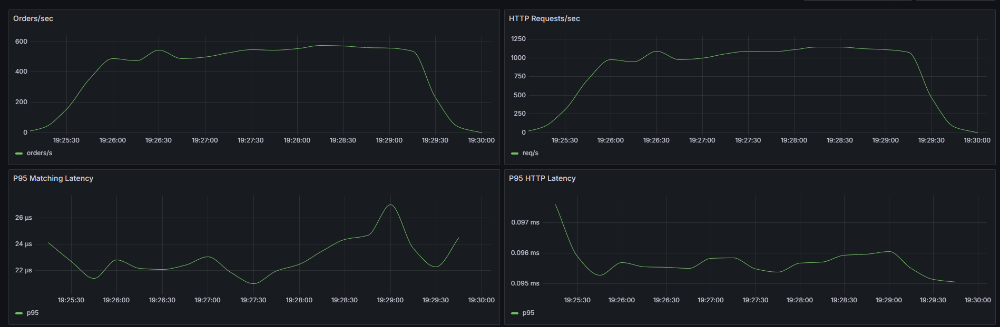
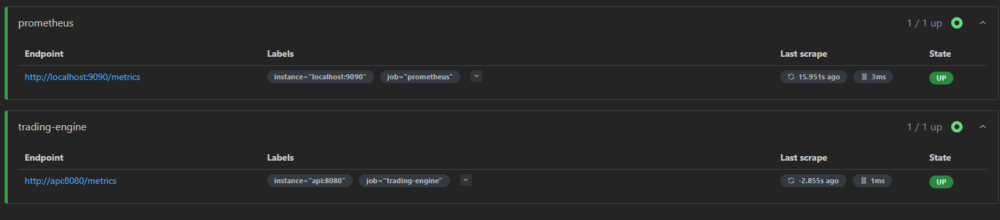

<div align="center">


# AxiomX - High-Performance Order Matching Engine

**500+ orders/sec &bull; P95 &lt; 5ms &bull; Sub-10�s matching &bull; Zero failures under load**

[](https://go.dev/)
[](https://kafka.apache.org/)
[](https://www.postgresql.org/)
[](https://redis.io/)
[](https://kubernetes.io/)
[](https://www.terraform.io/)
[](https://www.docker.com/)
[](https://prometheus.io/)
[](https://grafana.com/)
[](LICENSE)

</div>

---

## What is AxiomX?

A production-grade cryptocurrency order matching engine built to demonstrate expertise in **low-latency Go systems**, **event-driven architecture**, and **cloud-native infrastructure**. Processes 500+ orders/second with sub-10�s matching and sub-5ms P95 end-to-end latency at zero failures.

**Every line of code represents a conversation I'm ready to have in an interview.**

---

## The Numbers (Verified Locally - June 26, 2026)

All tests run on the full 8-service stack: Go API + Kafka + PostgreSQL + Redis + Prometheus + Grafana + Loki.

### Heavy Load: 4 minutes, 100 concurrent users
127,251 orders submitted + 127,251 health checks = 254,502 total requests:

| Metric | Value |
|---|---|
| **Total Requests** | 254,502 |
| **Request Rate** | 960 req/s |
| **Orders Processed** | 127,253 (480/sec) |
| **Failure Rate** | **0.00%** |
| **P50 Latency** | 2.02 ms |
| **P95 Latency** | 3.93 ms |
| **Avg Matching Time** | **8.7 �s** (sub-10�s in-memory match) |

### Mixed Workload: 3 minutes, 100 concurrent users
Realistic mix: 50% orders, 20% health, 15% book snapshots, 15% stats:

| Metric | Value |
|---|---|
| **Total Requests** | 206,690 |
| **Throughput** | 1,034 req/s |
| **Failure Rate** | **0.00%** |
| **Order P95** | 20.71 ms (full pipeline: risk check ? match ? Kafka ? DB ? Redis) |
| **Book P95** | 3.62 ms |
| **Health P95** | 3.47 ms |

### Prometheus Live Metrics (during load)
```
orders_processed_total:  130/sec sustained
matching_latency P95:    22.4 �s
```

---

## Architecture


### Grafana Dashboard

Live metrics during 251K-request load test at 100 concurrent users:



### Prometheus Targets



### What happens when an order arrives:

1. **HTTP POST** `/orders` hits the API
2. **Risk engine** validates position limits, order size caps, price sanity
3. **Order event** published to Kafka (fire-and-forget, non-blocking)
4. **WebSocket broadcast** notifies all connected clients
5. **Matching engine** runs the order through the price-time priority book on a dedicated goroutine
6. **Trades** persisted to PostgreSQL and published back to Kafka
7. **Redis** trade counter incremented, order book snapshot cached
8. **Prometheus** metrics updated for latencies at every step
9. **Structured JSON log** emitted with correlation IDs

---

## Design Patterns in Practice

| Pattern | Implementation |
|---|---|
| **Event Sourcing** | All state changes emitted as immutable Kafka events; full audit trail |
| **CQRS** | Write path (matching) separate from read path (Redis-cached snapshots) |
| **Actor Model** | Matching engine runs on a dedicated goroutine with channel-based serialization |
| **Graceful Degradation** | Kafka, Redis, PostgreSQL all optional - engine runs without any of them |
| **Backpressure** | Buffered channels with configurable queue depth (default 2048) |

---

## Tech Stack Deep-Dive

### Core Engine (Go 1.23)
```
internal/
+-- engine/
�   +-- types.go         # Order, Trade, Side types
�   +-- orderbook.go     # In-memory price-time priority matching
�   +-- processor.go     # Goroutine-based processing pipeline
+-- api/
�   +-- server.go        # HTTP + WebSocket handlers, metrics, logging
+-- events/
�   +-- publisher.go     # Kafka producer (async, non-blocking)
+-- risk/
�   +-- engine.go        # Position tracking, order validation
+-- storage/
�   +-- trade_store.go   # PostgreSQL + in-memory fallback
+-- cache/
�   +-- redis.go         # Redis cache with TTL-based invalidation
+-- websocket/
�   +-- broadcaster.go   # Fan-out real-time market data to clients
+-- metrics/
�   +-- metrics.go       # Prometheus histograms, counters, gauges
+-- logging/
    +-- logger.go        # Structured JSON logging (Loki-compatible)
```

### Infrastructure (IaC + Orchestration)

| Tool | Purpose |
|---|---|
| **Docker / Compose** | 8-service local stack (API, Kafka, Zookeeper, PostgreSQL, Redis, Prometheus, Grafana, Loki) |
| **Kubernetes** | Production manifests: Deployments, Services, HPA, ConfigMaps, Secrets, PDBs |
| **Helm** | Templated charts with value files for dev/staging/prod environments |
| **Terraform** | AWS provisioning: VPC, EKS, RDS (Multi-AZ), MSK, ElastiCache, IAM |
| **Ansible** | Playbooks for cluster bootstrap and configuration management |

---

## Quick Start

```bash
git clone https://github.com/mubashir05-beep/AxiomX.git && cd AxiomX

# Full stack: API + Kafka + Postgres + Redis + Prometheus + Grafana + Loki
docker-compose up -d

# Verify
curl http://localhost:8081/health                     # ? {"status":"ok"}

# Submit a limit buy order
curl -X POST http://localhost:8081/orders \
  -H "Content-Type: application/json" \
  -d '{"order_id":"buy-1","side":"buy","order_type":"limit","price_ticks":3000000,"qty":100000000}'

# Submit a matching sell
curl -X POST http://localhost:8081/orders \
  -H "Content-Type: application/json" \
  -d '{"order_id":"sell-1","side":"sell","order_type":"limit","price_ticks":3000000,"qty":100000000}'
  # ? Returns trade in response

# View dashboards
# Grafana:  http://localhost:3000  (admin/admin)
# Prometheus: http://localhost:9090
# API metrics: http://localhost:8081/metrics
```

### Services on localhost

| Service | Port | Purpose |
|---|---|---|
| **API Server** | 8081 | REST + WebSocket |
| **PostgreSQL** | 5432 | Trade persistence |
| **Kafka** | 9092 | Event streaming |
| **Zookeeper** | 2181 | Kafka coordination |
| **Prometheus** | 9090 | Metrics collection |
| **Grafana** | 3000 | Dashboards |
| **Loki** | 3100 | Log aggregation |

---

## API Reference

### Orders
```
POST /orders          Submit limit or market order
GET  /book            Order book snapshot (Redis-cached, 10s TTL)
GET  /risk/position?user_id=X   Current position for user
GET  /stats           Trade count, active clients, levels
```

### Streaming
```
WS   /ws              Real-time trades and order broadcasts
```

### Observability
```
GET  /health          Liveness check
GET  /metrics         Prometheus scrape endpoint
GET  /debug/pprof     Go profiling (CPU, heap, goroutine)
```

---

## Skills Demonstrated

This project intentionally covers ground relevant to **senior backend / platform / SRE roles**:

- **Go concurrency**: goroutines, channels, `sync.RWMutex`, actor-model processing
- **Distributed systems**: event sourcing, CQRS, Kafka producers, eventual consistency
- **Real-time data**: WebSocket fan-out, broadcast pattern, connection lifecycle
- **Risk & compliance**: position tracking, order validation, audit trail via Kafka
- **Observability**: Prometheus histograms/counters/gauges, structured JSON logging, Loki compatibility
- **Containerization**: multi-stage Docker builds, Compose orchestration, health checks
- **Kubernetes**: Deployments, HPA, PDBs, ConfigMaps, Secrets, ServiceMonitors
- **IaC**: Terraform AWS modules, Helm chart templating, Ansible playbooks
- **Performance engineering**: k6 load testing, latency optimization, profiling

---

## For Recruiters & Hiring Managers

See **[docs/recruiter/START_HERE.md](docs/recruiter/START_HERE.md)** for the fastest path to understanding this project.

Key documents:
- **[docs/recruiter/RELEASE_NOTES_v1.0.0.md](docs/recruiter/RELEASE_NOTES_v1.0.0.md)** - What was built and why
- **[docs/recruiter/ABOUT_SUMMARIES.md](docs/recruiter/ABOUT_SUMMARIES.md)** - Pre-written summaries for GitHub, LinkedIn, Twitter
- **[docs/recruiter/PUBLISHING_GUIDE.md](docs/recruiter/PUBLISHING_GUIDE.md)** - Portfolio integration guide
- **[docs/recruiter/CHECKLIST.md](docs/recruiter/CHECKLIST.md)** - Pre-launch quality checklist

---

## License

MIT - use, modify, and distribute freely.

---

<div align="center">

**Built for speed. Designed for scale. Ready for production.**

[Portfolio](https://mubash1r.vercel.app) &bull; [LinkedIn](https://linkedin.com/in/muhammad-mubashir-munir-khan) &bull; [GitHub](https://github.com/mubashir05-beep)

</div>
